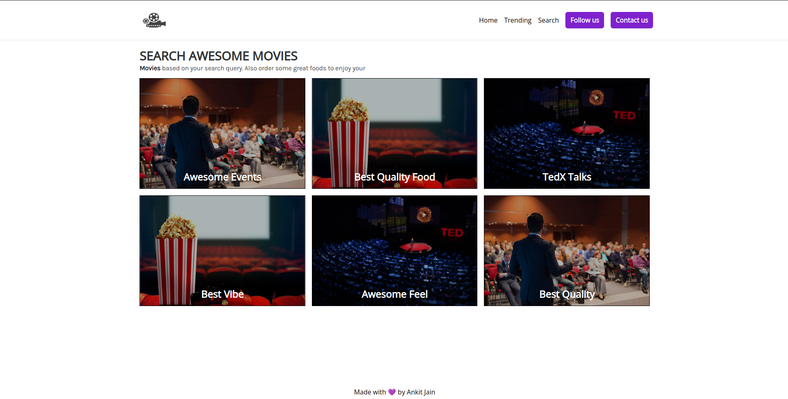
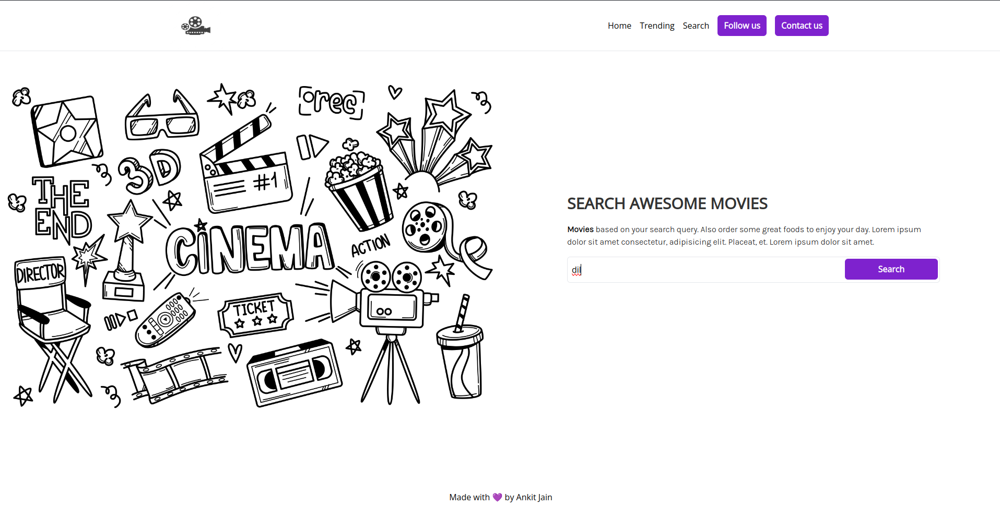
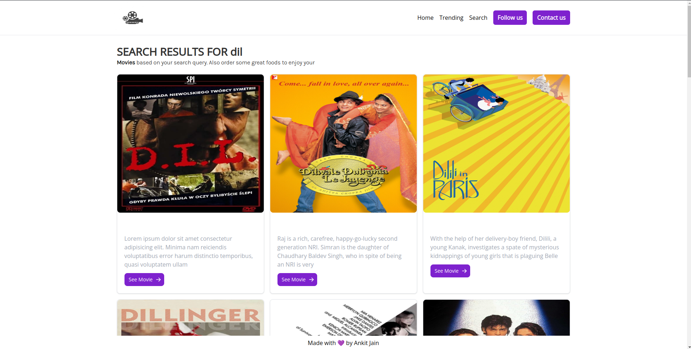

# Movie App

This is a Node.js project utilizing the Handlebars template engine to create a Movie App. The app allows users to search for movies using a query, fetching data from a remote API (TMDB) using Axios. The project follows the MVC (Model-View-Controller) architecture for better organization and separation of concerns.

## Features

- Search for movies using a query
- Fetches movie data from a remote API using Axios
- Utilizes MVC architecture for better organization
- Dynamic content rendering using Handlebars

## Technologies Used

- Node.js
- Handlebars
- Axios

## Setup

To run this project locally, follow these steps:

1. Clone the repository:

   ```bash
   git clone https://github.com/AnkitJain78/Movies-App.git
   cd Movies-App

2. Install dependencies:

   ```bash
   npm install

3. Create a .env file in the root directory and add your API key:

   ```plaintext
   API_KEY=your_api_key_here
   BASE_URL=your_base_url_here

4. Start the server:

   ```bash
   npm start

5. Open your web browser and go to http://localhost:5000 to view the app.

## Screenshots





## License

This project is licensed under the MIT License - see the [LICENSE](LICENSE) file for details.


   
